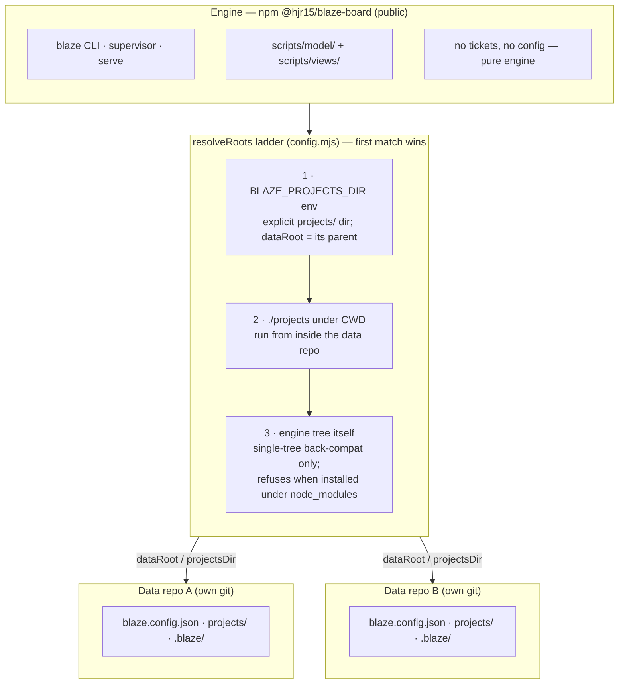

<p align="center">
  
</p>

<p align="center"><b>Agentic AI for App Development</b><br>
A file-based, git-native issue tracker built for AI coding agents to drive.</p>

---

Blaze is plain files, all the way down:

- **A ticket is a markdown file** — frontmatter + a body. No database, no login.
- **A ticket's status is the directory it sits in.** There is no `status:` field, so
  it cannot drift out of sync with reality.
- **Git is the history.** `git log --follow` on a ticket file is its full audit trail;
  every mutation is a small, revertable commit.
- **The board is a rendering, never a second source of truth** — `blaze board` reads
  the same files you'd `ls` / `grep` / `git mv` by hand.

It's built AI-first: an agent drives the tracker with the file tools it already has,
or with the `blaze` CLI. No API client, no auth, no SDK required either way.

## Documentation

New here? The **[user guide](docs/guide/)** covers Blaze end to end:
[Why Blaze](docs/guide/why-blaze.md) ·
[How it works](docs/guide/how-it-works.md) ·
[Getting started](docs/guide/getting-started.md) ·
[Command reference](docs/guide/commands.md) ·
[The schema](docs/guide/schema.md) ·
[Driving Blaze with an AI agent](docs/guide/driving-with-an-ai-agent.md).

## Install

```bash
npm i -g @hjr15/blaze-board
# or, without installing:
npx @hjr15/blaze-board <command>
```

Requires Node 20+ and `git` on `PATH`.

## The engine ⟂ data split

This package is the **engine** — the `blaze` CLI and its web board. Your tickets
live in a separate **data repo**: a `blaze.config.json` plus a
`projects/<KEY>/<status>/` tree, versioned in its own git history.

Attach the engine to a data repo one of two ways:

- run `blaze` from inside the data repo (it looks for a `projects/` directory in
  the current working directory), **or**
- set `BLAZE_PROJECTS_DIR` to the data repo's `projects/` directory, from anywhere.

One global `npm i -g @hjr15/blaze-board` install can drive any number of unrelated
data repos this way — upgrade the engine once, keep every board's ticket history in
its own repo.

<!-- DIAGRAM:BEGIN docs/diagrams/engine-data-split.md -->

<!-- DIAGRAM:END -->

See [`docs/architecture.md`](docs/architecture.md) for the full as-built picture.

## Quickstart

```bash
# 1. a data repo — just a directory with its own git history
mkdir my-tracker && cd my-tracker && git init

# 2. the engine needs a key and at least one project
mkdir -p projects/ENG
cat > blaze.config.json <<'EOF'
{ "key": "ENG", "projects": ["ENG"] }
EOF
git add -A && git commit -m "init board"

# 3. create a ticket — task/story/bug require --estimate; every type gets a
#    scaffolded description body
blaze new --project ENG --type task "Fix the export bug" --estimate 30

# 4. open the board
blaze board   # → http://localhost:4321
```

`blaze new` writes the ticket, validates it against the schema, and commits it — one
small commit per ticket, scoped to the files it actually touched.

## CLI verbs

| Command | Does |
|---|---|
| `blaze new --project <KEY> --type <type> "<title>" [--estimate m] [--parent ID] [--priority p] [--labels a,b] [--components a,b] [--reason "<why blank>"]` | Create a ticket in its type's initial status |
| `blaze move <id> <status>` | Change status (validates the transition; auto-sets `resolution` on a terminal status) |
| `blaze resolve <id> <done\|wont-do\|duplicate\|cannot-reproduce>` | Set a non-default resolution without moving the file |
| `blaze log <id> <minutes>` | Append a worklog entry |
| `blaze rollup [<id>]` | Print rolled-up estimate/logged time for one node, or a summary of every goal/epic |
| `blaze reconcile [--apply] [--fetch]` | Mirror a linked code repo's branch/PR state onto delivery-workflow tickets (dry-run by default) |
| `blaze edit <id> ...` | Edit ticket fields |
| `blaze link [--rm] <id> <TYPE> <target>` | Add (or `--rm` remove) a typed link on `<id>` — `TYPE` ∈ `Blocks`/`Relates`/`Duplicate`/`Cloners` |
| `blaze reindex` | Rebuild/validate the on-disk index (warns on malformed or dangling `links` entries) |
| `blaze commit` | Flush queued ops into one commit (`commitMode: batch`) |
| `blaze migrate [--dry-run\|--live] [--project <KEY>]` | Import tickets from an external tracker via a reviewed disposition ledger (`--project` optional — falls back to `blaze.config.json`'s `projects` list) |
| `blaze board` | Serve the read/write dashboard (kanban + `/api/*` write endpoints) |

See [`AGENTS.md`](AGENTS.md) for the full contract — types, workflows, the git join
key, and how an agent should drive the board.

## The board

`blaze board` serves a live rendering over the files — never a second source of truth:

- **Search** over id / title / labels / assignee, filtering every view live.
- **Status filter chips** with live counts plus `All` / `Active` presets; the
  selection lives in the URL hash, so a filtered board is a shareable link.
  Search and chips compose.
- **Board, List, Metrics and Live** views, switchable in the header.
- A **detail panel** — click a ticket id for the rendered description, full
  frontmatter, parent/children and links; Acceptance-Criteria checkboxes toggle
  in place and commit.

## Configuration

`blaze.config.json` lives at the data repo's root. Minimally:

```json
{ "key": "ENG", "projects": ["ENG"] }
```

`key` is the ticket id prefix (`ENG-1`, `ENG-2`, ...); `projects` lists which
`projects/<KEY>/` directories the board renders. Per-project settings (`labels`,
`components`, `requireLabels`/`requireComponents`, `codeRepos` to mirror,
`requireWorklogBeforeTerminal`) live in `projects/<KEY>/project.json` — see
[`AGENTS.md`](AGENTS.md#configuration).

A project that declares `labels`/`components` in `project.json` turns those
lists into a taxonomy: `blaze new`/`blaze edit` reject any value not on the
list (add it to `project.json` first). An empty (or undeclared) list opts out —
existing projects with no taxonomy see no change. Separately,
`requireLabels`/`requireComponents` (default `false`) make `blaze new` print a
warning — never a hard failure — when the corresponding field is left empty;
pass `--reason "<why blank>"` to suppress it.

A `views` block toggles which of Board / List / Live / Metrics / Map / Gantt are
available — every view defaults to `true`, so an existing config sees no
change. Set one to `false` (e.g. `"views": { "map": false }`) to hide its
pill and 404 its fragment endpoint until it's ready; `board` can't be
disabled since the shell always needs a default view.

An optional integer `schemaVersion` stamps which schema contract the board was
written against; absent means `1`, the pre-versioning baseline, so existing
boards need no change. The engine refuses to load a board stamped outside the
window it supports (currently `1..1`) instead of silently misreading it — see
[`docs/schema-versioning.md`](docs/schema-versioning.md).

The type registry and workflows are themselves configurable: add a `schema` block
(top-level or per-project) to override or extend the built-in defaults without
editing engine source — see
[`docs/schema-customization.md`](docs/schema-customization.md).

## Forkability guarantees / CI gates

This is a public, forkable engine, and CI enforces three guarantees that keep it that
way:

- **Backward-compatibility contract** — a fixture board written in an older ticket
  format is loaded, indexed, and dry-run reconciled against the current engine on
  every PR. If a future change quietly makes a field that used to be optional
  load-bearing for indexing or reconcile, this gate fails loudly instead of letting
  every board authored under the old shape break silently.
- **Package smoke gate** — the package is packed into a tarball, installed into a
  clean throwaway project (no repo `node_modules` in the loop), and the *installed*
  CLI is booted against a fresh fixture. This catches packaging mistakes — a missing
  `files`/`bin` entry, a runtime import of a file that never shipped — that running
  tests against the repo checkout would never surface.
- **Upstream hygiene bar** — every PR's own commits and added diff lines are scanned
  for things that don't belong in a public repo other people are meant to fork: a
  co-author trailer, an internal hostname, or an absolute user-home filesystem path.
  The scan is scoped to commits/lines unique to the PR, and exempts Markdown prose
  from the content scan so docs that describe these rules (like this one) don't trip
  on themselves.

Together, a change has to clear all three before merge: don't break old boards,
don't break the published package, and don't leak anything private into the fork.

## Origin

This is a public continuation of [`sychyoboN/blaze`](https://github.com/sychyoboN/blaze).

## License

MIT.
