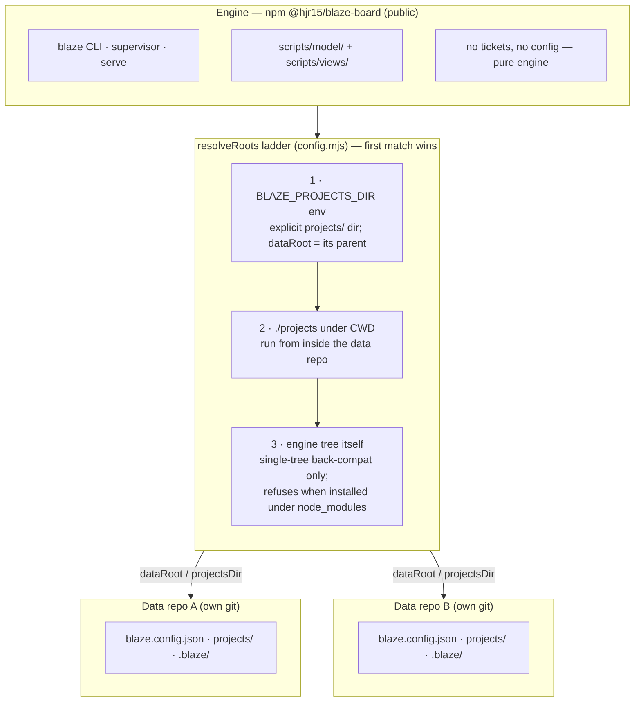
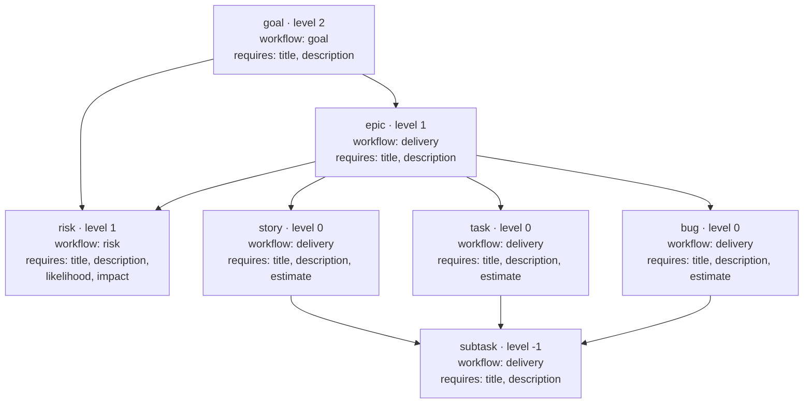
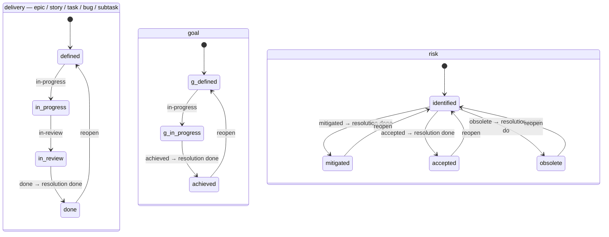

# Architecture

The current as-built shape of the Blaze **engine**. For the original design
rationale (why file-based, why the loops, the brand) see [`design.md`](design.md);
for customising the type/workflow registry see
[`schema-customization.md`](schema-customization.md). Diagrams are authored once in
[`diagrams/`](diagrams/) and embedded below.

## The one rule

A ticket is a markdown file, and **its status is the directory it sits in** —
`projects/<KEY>/<status>/<id>-slug.md`. There is no `status:` field, so status
cannot drift out of sync with reality, and `git log --follow` on a ticket file is
its full audit trail. Everything else is built to preserve that: the derived
`.blaze/` caches are disposable, the web board is a rendering, and every mutation
goes through git.

## Runtime components

One `blaze` command is the entry point. CLI verbs dispatch through thin
`scripts/*-runner.mjs` wrappers to pure cores in `scripts/model/`; `blaze start`
boots the supervisor (web board + reconcile and groomer loops); `blaze board`
serves the read/write web board alone.

<!-- DIAGRAM:BEGIN docs/diagrams/architecture.md -->
```mermaid
flowchart TB
    CLI["blaze CLI (scripts/cli.mjs)"]

    subgraph Runners["CLI verbs → *-runner.mjs"]
        direction LR
        R1["new · move · edit<br/>resolve · log"]
        R2["commit · rollup<br/>reindex · migrate"]
    end

    subgraph Sup["blaze start → supervisor.mjs"]
        direction TB
        Rec["reconcile loop<br/>(deterministic: git/PR → status)"]
        Groom["groomer loop<br/>(agentic: spawns agentCommand)"]
    end

    subgraph Board["blaze board → serve.mjs (web board)"]
        direction TB
        Views["views/: page (switcher)<br/>board · list · live · metrics · map · panel"]
        API["GET /api/{hash,sync,live,panel,reconcile-preview}<br/>POST /api/{move,edit,resolve,log,ac}"]
    end

    subgraph Model["scripts/model/ — one rules home"]
        direction LR
        M1["schema · workflows · rules<br/>move-plan · ticket · taxonomy"]
        M2["index · rollup · time · ids<br/>activity · transitions · search · filters · metrics · links"]
    end

    subgraph Data["Data repo (own git history)"]
        direction TB
        Files["projects/&lt;KEY&gt;/&lt;status&gt;/&lt;id&gt;-slug.md<br/>(source of truth)"]
        Caches[".blaze/ — index.json · transitions.json<br/>activity.jsonl (derived, disposable)<br/>pending/&lt;session&gt;.jsonl + fallback queue<br/>commit.lock/ (write coordination)"]
    end

    CLI --> Runners
    CLI --> Sup
    CLI --> Board
    Sup --> Board

    Runners --> Model
    Rec --> Model
    Board --> Model
    Model --> Files
    Model --> Caches
    Rec -. reads branches/PRs .-> Ext["mirrored code repos (git + gh)"]
    Groom -. edits ticket .md .-> Files
```
<!-- DIAGRAM:END -->

- **CLI + runners** — `cli.mjs` maps each verb (`new`, `move`, `edit`, `resolve`,
  `log`, `commit`, `rollup`, `reindex`, `migrate`, `reconcile`, `groom`) to a
  `*-runner.mjs` that wraps a pure `apply*`/model core and then commits via
  `commit-or-queue.mjs` (per-op commit, or a queued entry in `batch` mode —
  session-keyed to `.blaze/pending/<BLAZE_SESSION>.jsonl` since v0.4.0, so
  `blaze commit` flushes only the caller's queue and `--all` sweeps them all).
  Both git-write surfaces serialize on the advisory `commit-lock.mjs`
  (`.blaze/commit.lock/`, stale locks auto-stolen) — see AGENTS.md
  "Sessions (parallel agents on one board)".
- **Model (`scripts/model/`)** — the single home for all rules: `schema`,
  `workflows`, `rules`, `move-plan`, `ticket`, `taxonomy` (validation +
  transitions); `index`, `rollup`, `time`, `ids`, `activity`, `transitions`,
  `search`, `filters`, `metrics`, `links` (derived views over the files). The
  CLI, the board, and the loops all call these — no rule is ever duplicated in a
  consumer. Two of these are the metadata-gate additions: `taxonomy` runs at
  `new`/`edit` write time, rejecting a `labels`/`components` value the project
  hasn't declared (empty/undeclared taxonomy opts out); `links` runs at
  `reindex`/index-build time, warning (never failing) on a malformed `to:` key,
  an unknown link type, or a dangling target.
- **Web board (`scripts/serve.mjs` + `scripts/views/`)** — `views/page.mjs` is the
  switcher shell composing the Board / List / Live / Metrics / Map views and the
  detail panel, each a `{ render, styles, clientScript }` module over the served
  model. `serve.mjs` is routing plus the `/api/*` handlers.
- **Supervisor + loops (`scripts/supervisor.mjs`, `scripts/loops/`)** — the
  deterministic `reconcile` loop (git/PR state → status) and the agentic `groomer`
  loop (spawns the configured `agentCommand` to triage a backlog ticket). All loop
  effects go through git on the data repo.

## HTTP surface

The board serves a small JSON API over `127.0.0.1` (a per-process CSRF token
guards the writes):

| Method | Route | Purpose |
|---|---|---|
| GET | `/` | The board page (`views/page.mjs`) |
| GET | `/view/<name>` | JSON fragment (`{ view, html, chipbar, crumbs, total, subline }`) for a client-side view swap; 404 for an unknown or config-disabled view (`views.<name>: false`, see [AGENTS.md — Configuration](../AGENTS.md#configuration)) |
| GET | `/api/hash` | Cheap content hash — the client reloads only when tickets change |
| GET | `/api/sync` | Unsynced-commit count for the `⇧ N ahead` badge |
| GET | `/api/live` | Live agent-activity feed (`model/activity.mjs`) |
| GET | `/api/panel?id=` | Detail-panel HTML for one ticket |
| GET | `/api/reconcile-preview` | Dry-run of the code-bound moves reconcile would make |
| POST | `/api/move` · `/api/edit` · `/api/resolve` · `/api/log` · `/api/ac` | Mutations — each validates through the model core, writes one file, commits it locally (never `git add -A`, never auto-push) |

## Engine ⟂ data split

The engine is published as `@hjr15/blaze-board` and holds no tickets; the data
lives in a separate repo with its own git history. One engine install drives any
number of data repos, attaching via the `resolveRoots` ladder.

<!-- DIAGRAM:BEGIN docs/diagrams/engine-data-split.md -->

<!-- DIAGRAM:END -->

## The type registry

Types, their hierarchy, parent rules, and required fields are defined once in
`model/schema.mjs` and overridable per data repo through a `schema` block.

<!-- DIAGRAM:BEGIN docs/diagrams/type-hierarchy.md -->

<!-- DIAGRAM:END -->

## Workflows

Each type is bound to one of three workflows. Transitions are enforced (adjacent
edge or reopen only); entering a terminal status auto-sets `resolution` on a
separate axis.

<!-- DIAGRAM:BEGIN docs/diagrams/workflow-state-machines.md -->

<!-- DIAGRAM:END -->
