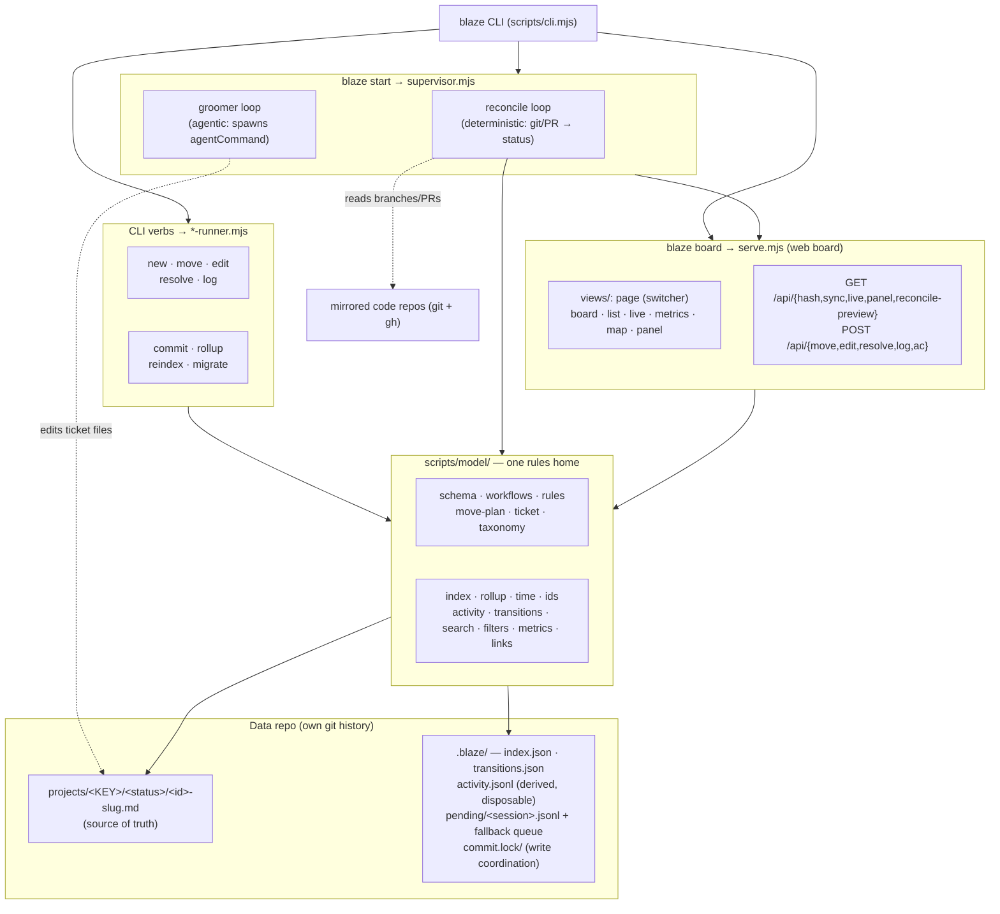
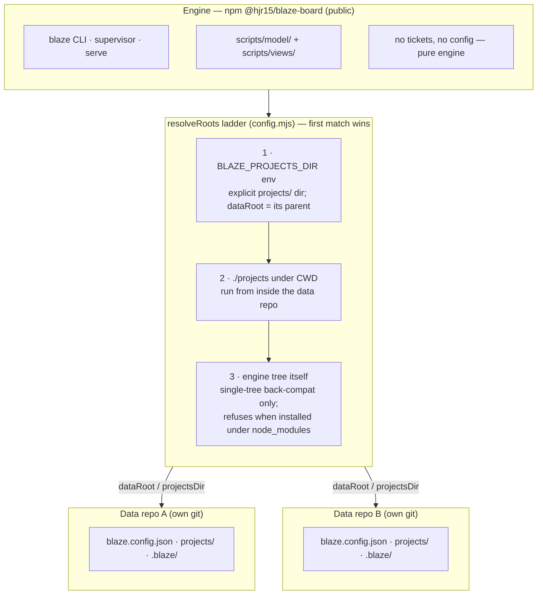
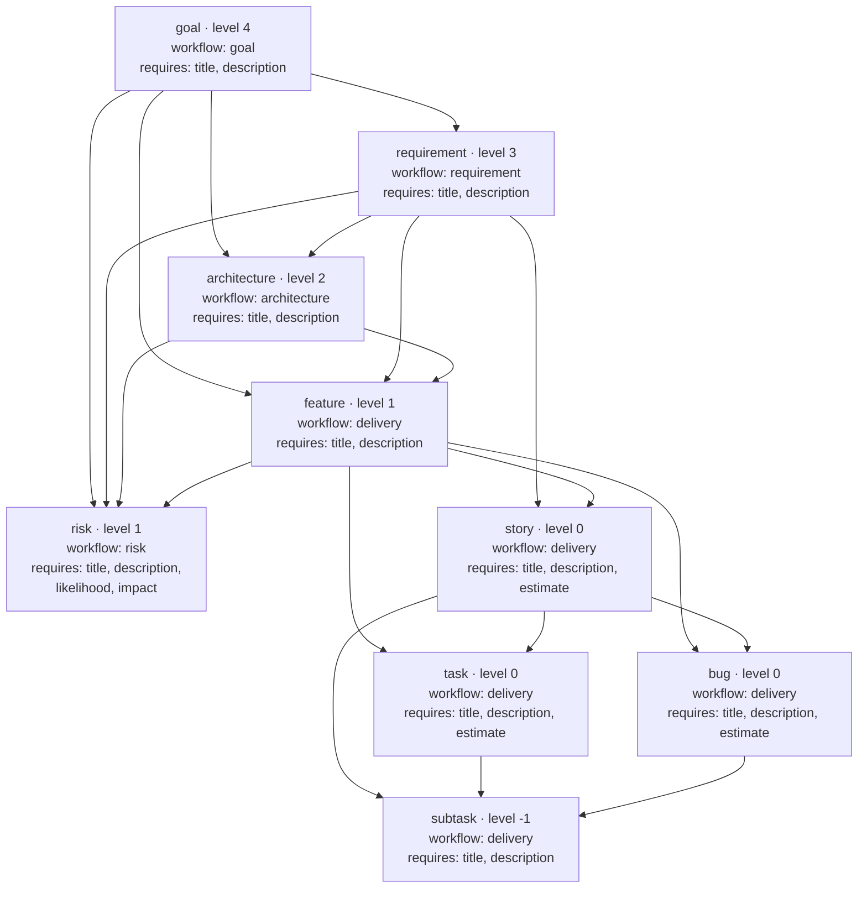
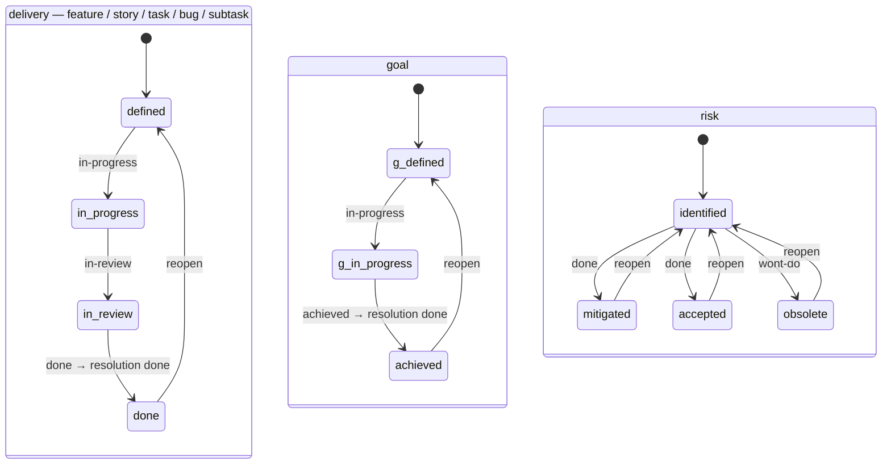

# Architecture

The current as-built shape of the Blaze **engine**. For the original design
rationale (why file-based, why the loops, the brand) see [`design.md`](design.md);
for customising the type/workflow registry see
[`schema-customization.md`](schema-customization.md); for the config-schema
compat guard see [`schema-versioning.md`](schema-versioning.md). Diagrams are
authored once in [`diagrams/`](diagrams/) and embedded below.

## The one rule

A ticket is a markdown file, and **its status is the directory it sits in** —
`projects/<KEY>/<status>/<id>-slug.md`. There is no `status:` field, so status
cannot drift out of sync with reality, and `git log --follow` on a ticket file is
its full audit trail. Everything else is built to preserve that: the derived
`.blaze/` caches are disposable, the web board is a rendering, and every mutation
goes through git.

## Runtime components

One `blaze` command is the entry point. CLI verbs dispatch through thin
`scripts/*-runner.mjs` wrappers to pure cores in `scripts/model/`; `blaze start`
boots the supervisor (web board + reconcile and groomer loops); `blaze board`
serves the read/write web board alone.

<!-- DIAGRAM:BEGIN docs/diagrams/architecture.md -->

```mermaid
flowchart TB
    CLI["blaze CLI (scripts/cli.mjs)"]

    subgraph Runners["CLI verbs → *-runner.mjs"]
        direction LR
        R1["new · move · edit<br/>resolve · log"]
        R2["commit · rollup<br/>reindex · migrate"]
    end

    subgraph Sup["blaze start → supervisor.mjs"]
        direction TB
        Rec["reconcile loop<br/>(deterministic: git/PR → status)"]
        Groom["groomer loop<br/>(agentic: spawns agentCommand)"]
    end

    subgraph Board["blaze board → serve.mjs (web board)"]
        direction TB
        Views["views/: page (switcher)<br/>board · list · live · metrics · map · panel"]
        API["GET /api/{hash,sync,live,panel,reconcile-preview}<br/>POST /api/{move,edit,resolve,log,ac}"]
    end

    subgraph Model["scripts/model/ — one rules home"]
        direction LR
        M1["schema · workflows · rules<br/>move-plan · ticket · taxonomy"]
        M2["index · rollup · time · ids<br/>activity · transitions · search · filters · metrics · links"]
    end

    subgraph Data["Data repo (own git history)"]
        direction TB
        Files["projects/&lt;KEY&gt;/&lt;status&gt;/&lt;id&gt;-slug.md<br/>(source of truth)"]
        Caches[".blaze/ — index.json · transitions.json<br/>activity.jsonl (derived, disposable)<br/>pending/&lt;session&gt;.jsonl + fallback queue<br/>commit.lock/ (write coordination)"]
    end

    CLI --> Runners
    CLI --> Sup
    CLI --> Board
    Sup --> Board

    Runners --> Model
    Rec --> Model
    Board --> Model
    Model --> Files
    Model --> Caches
    Rec -. reads branches/PRs .-> Ext["mirrored code repos (git + gh)"]
    Groom -. edits ticket files .-> Files
```
<!-- DIAGRAM:END -->

- **CLI + runners** — `cli.mjs` maps each verb (`new`, `move`, `edit`, `resolve`,
  `log`, `commit`, `rollup`, `reindex`, `migrate`, `reconcile`, `groom`) to a
  `*-runner.mjs` that wraps a pure `apply*`/model core and then commits via
  `commit-or-queue.mjs` (per-op commit, or a queued entry in `batch` mode —
  session-keyed to `.blaze/pending/<session>.jsonl` since v0.4.0, where
  `<session>` is `BLAZE_SESSION` if set, else auto-derived from the agent
  harness's own session id, else the shared legacy fallback when neither is
  present — so `blaze commit` flushes only the caller's queue, refusing the
  fallback without `--shared`, and `--all` sweeps them all unconditionally).
  Both git-write surfaces serialize on the advisory `commit-lock.mjs`
  (`.blaze/commit.lock/`, stale locks auto-stolen) — see AGENTS.md
  "Sessions (parallel agents on one board)".
  `cli.mjs`'s `SUBCOMMANDS` table is the single dispatch point (no separate
  switch) and the only place a verb's `mutates` classification lives:
  `BLAZE_READONLY=1` (AGENTS.md "Read-only mode") makes it refuse to spawn any
  mutating runner, gated here rather than inside `commit-or-queue.mjs` — every
  mutating verb writes/renames the ticket file before it ever reaches a commit
  decision, so declining only the commit would leave a relocated-but-uncommitted
  file in a shared tree. `commit-or-queue.mjs`, `pending-ledger.mjs`, and
  `serve.mjs`'s `/api/*` handlers carry the same check as defence-in-depth for
  callers that reach them by some path other than `cli.mjs` dispatch.
- **Model (`scripts/model/`)** — the single home for all rules: `schema`,
  `workflows`, `rules`, `move-plan`, `ticket`, `taxonomy` (validation +
  transitions); `index`, `rollup`, `time`, `ids`, `activity`, `transitions`,
  `search`, `filters`, `metrics`, `links` (derived views over the files). The
  CLI, the board, and the loops all call these — no rule is ever duplicated in a
  consumer. Two of these are the metadata-gate additions: `taxonomy` runs at
  `new`/`edit` write time, rejecting a `labels`/`components` value the project
  hasn't declared (empty/undeclared taxonomy opts out); `links` runs at
  `reindex`/index-build time, warning (never failing) on a malformed `to:` key,
  an unknown link type, or a dangling target.
- **Web board (`scripts/serve.mjs` + `scripts/views/`)** — `views/page.mjs` is the
  switcher shell composing the Board / List / Live / Metrics / Map views and the
  detail panel, each a `{ render, styles, clientScript }` module over the served
  model. `serve.mjs` is routing plus the `/api/*` handlers.
- **Supervisor + loops (`scripts/supervisor.mjs`, `scripts/loops/`)** — the
  deterministic `reconcile` loop (git/PR state → status) and the agentic `groomer`
  loop (spawns the configured `agentCommand` to triage a backlog ticket). All loop
  effects go through git on the data repo.

## HTTP surface

Blaze runs **two HTTP servers**, and the claim below is true of both. `blaze board`
serves `serve.mjs`; `blaze start` — and bare `blaze`, the default command — serves
`supervisor.mjs`, which is the board plus a control strip and an activity stream.

**Every request either server answers under `/api/*`, `/control/*`, `/events`, `/` or
`/view/<name>` passes through `model/serve-auth.mjs`'s `gate()`**, which classifies the
route and decides it. An `/api/*` or `/control/*` route with no classification is a
`404`, so an endpoint added without a scope fails closed rather than inheriting the
previous one's. Board content — `GET /` and `GET /view/<name>` — is gated at `read` on
both servers, because the page is rendered server-side and carries every ticket.

> **The two servers differ in what they bind, not in whether they gate.** `serve.mjs`
> honours `HOST` and therefore consults `checkBindSafety` on a value an operator chose.
> `supervisor.mjs` is **loopback-by-construction**: it does not read `HOST`, binds
> `127.0.0.1`, and nothing widens it — `/control/revert` shells out to `git revert` and
> `/control/groomer/run` dispatches the configured agent, and neither belongs on an
> interface reachable from off the machine even with a token. `checkBindSafety` is still
> called there, on `startSupervisor`'s `host` argument, and both halves are pinned by
> test (`tests/supervisor-bind.test.mjs`) so a later edit cannot quietly widen the bind.

**Who may call it depends on whether the board has any identities** (ADR-0013):

| Identities | Bind address | Behaviour |
|---|---|---|
| none | loopback (`127.0.0.1`, `::1`, `localhost`) | Served without authentication, exactly as Blaze always has — the bind address *is* the boundary. This is `blaze start`'s only case, since it binds nothing else |
| none | anything else | **`blaze board` serves the first-run setup flow, and nothing else** (BLZ-358). Every other route answers `503` — the board is never served unauthenticated on an interface something else can reach, which is what the earlier refusal bought. `blaze start` still refuses, because it binds loopback by construction and has no setup flow of its own |
| one or more | any | Every `/api/*` and `/control/*` call needs `Authorization: Bearer blz_…`; the token's scopes are re-intersected with its owner's current role on every request |
| **unreadable** — `.blaze/identity.db` exists but will not open or has no schema | any | **Both servers refuse to start**, naming the file. Never read as "no identities": a stray file on an unprotected board and a truncated roster on a protected one are indistinguishable on disk, so treating the second as the first would silently remove authentication |

### First-run setup (BLZ-358)

A container has no TTY, so `scripts/init.mjs`'s wizard cannot reach `docker run -p
4321:4321`, and HTTP is the only channel that deployment has. On a non-loopback bind
with no identities the server therefore starts and serves a setup flow instead of
exiting.

**The setup route is protected by a one-time token written to
`<board>/.blaze/setup-token` at mode `0600`.** The server logs the *path*; the value is
never logged, rendered, or echoed back — not in the setup page, not in an error. The
operator reads it off disk and enters it. Completing setup creates the admin through
`addUser`, the same function `blaze user add` calls (ADR-0013 §5 — the first admin is a
user, not an exception), deletes the token file, and adopts the new identity in-process,
so the board it goes on to serve is authenticated rather than open. The route is then
gone, not hidden: it exists only while setup is pending, so afterwards it `404`s.

**What the token protects against, and what it does not.** It reaches only someone with
filesystem access — the same privilege that could edit `identity.db` directly — and,
decisively, it never enters a log stream, which a printed token would (`docker logs` is
shipped off-box by any aggregator). It is **not** transport security: the token crosses
the network in the POST body, so on a plain-HTTP LAN bind it is observable in transit,
and putting the flow behind a TLS-terminating proxy is the operator's job. It does not
survive a world-readable bind mount or a container running as root. And it does not stop
a race for an unconfigured board — whoever presents it first becomes the admin; the
window runs from first start to completed setup, and the mitigation is to finish setup.

On a **read-only data mount** (`-v <data>:/data:ro`, a supported mode) no token can be
written, so there is no setup flow to offer and the original refusal stands, saying why.

Create the first identity — which turns authentication on — with
[`blaze user add`](guide/commands.md#user), with `blaze init --admin-email=…`, or through
the setup flow above. All three go through `addUser`.

**Both servers read the roster once, at boot.** `startServer()` and `createApp()` each
resolve `loadIdentity()` a single time, so adding the first user to a board that is
ALREADY SERVING does not turn authentication on for that process — it keeps serving
unauthenticated until it is restarted. That is the same on both, and `blaze user add`
says so in its output. Re-reading the roster per request would fix it for real and is
tracked separately; doing it on one server and not the other would replace one rule an
operator has to know with two.

The `x-blaze-csrf` header is **not** authentication and never was — on either server: it
is a per-process `randomUUID()` embedded in the served HTML, readable by anyone who can
`GET /`. It is forgery protection for the browser flow, retained as defence-in-depth
alongside the gate, and removed with the last cookie (ADR-0013 §7). `supervisor.mjs`
requires it on every `/control/*` POST for one reason the board server does not share:
on a loopback board with no users the gate has no credential to demand, and a page in
the operator's own browser can POST cross-origin to `http://localhost:<port>/control/revert`
as a "simple request" — no preflight, response unreadable, side effect done. A token
cannot refuse that request and this does; it is still not a credential.

Scopes are `read` ⊂ `write` ⊂ `admin` by role: **viewer** = `read`, **member** =
`read, write`, **admin** = `read, write, admin`.

| Method | Route | Scope | Purpose |
|---|---|---|---|
| GET | `/` | `read` | The board page (`views/page.mjs`) — rendered server-side, so it carries every ticket and the CSRF token |
| GET | `/view/<name>` | `read` | JSON fragment (`{ view, html, chipbar, crumbs, total, subline }`) for a client-side view swap; 404 for an unknown or config-disabled view (`views.<name>: false`, see [AGENTS.md — Configuration](../AGENTS.md#configuration)) |
| GET | `/api/hash` | `read` | Cheap content hash — the client reloads only when tickets change |
| GET | `/api/sync` | `read` | Unsynced-commit count for the `⇧ N ahead` badge |
| GET | `/api/live` | `read` | Live agent-activity feed (`model/activity.mjs`) |
| GET | `/api/panel?id=` | `read` | Detail-panel HTML for one ticket |
| GET | `/api/reconcile-preview` | `read` | Dry-run of the code-bound moves reconcile would make |
| GET | `/api/matrix` · `/api/coverage` | `read` | v4 traceability matrix and coverage (BLZ-323) |
| POST | `/api/move` · `/api/edit` · `/api/resolve` · `/api/log` · `/api/ac` | `write` | Mutations — each validates through the model core, writes one file, commits it locally (never `git add -A`, never auto-push) |
| POST | `/api/artifact` · `/api/link` · `/api/baseline` | `write` | v4 artifact model mutations (BLZ-323) |
| POST | `/api/field` | `admin` | Defining a filterable field emits `ALTER TABLE` and spends the install-wide field budget ADR-0018 shares across every project — an administrative act, not an ordinary write |
| *anything else under* `/api/` | — | **`404 unknown endpoint`** — unclassified is denied |

`blaze start` (`supervisor.mjs`) serves the rows above that exist on it — `/`,
`/view/<name>`, `/api/hash`, `/api/sync` — at the same scopes, plus these of its own:

| Method | Route | Scope | Purpose |
|---|---|---|---|
| GET | `/events` | `read` | Server-sent activity stream — it names ticket ids and commit shas |
| POST | `/control/{reconcile,groomer}/{start,stop,run}` | `write` | Start, stop or fire one pass of a loop. `groomer/run` is the **agent-dispatch** endpoint; `reconcile/run` commits and pushes. None of them is a read — `start`/`stop` decide whether the other two happen at all |
| POST | `/control/revert` | `write` | `git revert --no-edit <sha>` on the board repo, for the ↩ button on a groom event |
| *anything else under* `/control/` | — | **`404 unknown endpoint`** — unclassified is denied |

`ROUTE_SCOPES` in `scripts/model/serve-auth.mjs` is the single source of the `/api/*`
rows; `pageScopeFor()` beside it owns the two content rows; `SUPERVISOR_SCOPES` in
`scripts/supervisor.mjs` owns the supervisor-only rows. The first two are shared by both
servers, so the routes they have in common cannot drift apart. An `/api/*` route absent
from `ROUTE_SCOPES`, or a `/control/*` route absent from `SUPERVISOR_SCOPES`, cannot be
called at all. An unknown *page* path is still a plain `404` rather than an auth decision
— the page router is not a fixed table, and turning every typo into a `401` would both
change long-standing behaviour and leak whether a path exists.

**A browser cannot set an `Authorization` header itself.** Once a board has users, its
content is reachable from the API, from `curl`, or through a reverse proxy that adds the
header — not from a bare browser tab. That is a known gap, not a finished story: the
board was already unusable in a browser at that point (the page rendered while every XHR
returned `401`), and gating `/` makes the failure honest instead of leaky. A first-run
sign-in flow is tracked separately and will replace this.

## Engine ⟂ data split

The engine is published as `@hjr15/blaze-board` and holds no tickets; the data
lives in a separate repo with its own git history. One engine install drives any
number of data repos, attaching via the `resolveRoots` ladder.

<!-- DIAGRAM:BEGIN docs/diagrams/engine-data-split.md -->

```mermaid
flowchart TB
    subgraph Engine["Engine — npm @hjr15/blaze-board (public)"]
        direction TB
        Bin["blaze CLI · supervisor · serve"]
        Model["scripts/model/ + scripts/views/"]
        Note["no tickets, no config — pure engine"]
    end

    subgraph Resolve["resolveRoots ladder (config.mjs) — first match wins"]
        direction TB
        L1["1 · BLAZE_PROJECTS_DIR env<br/>explicit projects/ dir; dataRoot = its parent"]
        L2["2 · ./projects under CWD<br/>run from inside the data repo"]
        L3["3 · engine tree itself<br/>single-tree back-compat only;<br/>refuses when installed under node_modules"]
        L1 --> L2 --> L3
    end

    subgraph DataA["Data repo A (own git)"]
        DA["blaze.config.json · projects/ · .blaze/"]
    end
    subgraph DataB["Data repo B (own git)"]
        DB["blaze.config.json · projects/ · .blaze/"]
    end

    Engine --> Resolve
    Resolve -->|dataRoot / projectsDir| DataA
    Resolve -->|dataRoot / projectsDir| DataB
```
<!-- DIAGRAM:END -->

## The type registry

Types, their hierarchy, parent rules, and required fields are defined once in
`model/schema.mjs` and overridable per data repo through a `schema` block.

<!-- DIAGRAM:BEGIN docs/diagrams/type-hierarchy.md -->

```mermaid
flowchart TD
    goal["goal · level 4<br/>workflow: goal<br/>requires: title, description"]
    requirement["requirement · level 3<br/>workflow: requirement<br/>requires: title, description"]
    architecture["architecture · level 2<br/>workflow: architecture<br/>requires: title, description"]
    feature["feature · level 1<br/>workflow: delivery<br/>requires: title, description"]
    risk["risk · level 1<br/>workflow: risk<br/>requires: title, description,<br/>likelihood, impact"]
    story["story · level 0<br/>workflow: delivery<br/>requires: title, description, estimate"]
    task["task · level 0<br/>workflow: delivery<br/>requires: title, description, estimate"]
    bug["bug · level 0<br/>workflow: delivery<br/>requires: title, description, estimate"]
    subtask["subtask · level -1<br/>workflow: delivery<br/>requires: title, description"]

    goal --> requirement
    goal --> architecture
    goal --> feature
    goal --> risk
    requirement --> architecture
    requirement --> feature
    requirement --> story
    requirement --> risk
    architecture --> feature
    architecture --> risk
    feature --> story
    feature --> task
    feature --> bug
    feature --> risk
    story --> task
    story --> bug
    story --> subtask
    task --> subtask
    bug --> subtask
```
<!-- DIAGRAM:END -->

## Workflows

Each type is bound to one of three workflows. Transitions are enforced (adjacent
edge or reopen only); entering a terminal status auto-sets `resolution` on a
separate axis.

<!-- DIAGRAM:BEGIN docs/diagrams/workflow-state-machines.md -->

```mermaid
stateDiagram-v2
    state "delivery — feature / story / task / bug / subtask" as delivery {
        [*] --> defined
        defined --> in_progress: in-progress
        in_progress --> in_review: in-review
        in_review --> done: done → resolution done
        done --> defined: reopen
    }

    state "goal" as goal {
        [*] --> g_defined
        g_defined --> g_in_progress: in-progress
        g_in_progress --> achieved: achieved → resolution done
        achieved --> g_defined: reopen
    }

    state "risk" as risk {
        [*] --> identified
        identified --> mitigated: done
        identified --> accepted: done
        identified --> obsolete: wont-do
        mitigated --> identified: reopen
        accepted --> identified: reopen
        obsolete --> identified: reopen
    }
```
<!-- DIAGRAM:END -->
