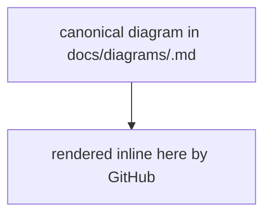

# Diagrams

Canonical home for every diagram in this repo. Each file holds exactly one diagram
with frontmatter declaring its `title`, `type`, and `format`.

| File | Type | Shows |
|---|---|---|
| [architecture.md](architecture.md) | architecture | The engine at runtime — CLI, supervisor + loops, web board, model, data/git |
| [engine-data-split.md](engine-data-split.md) | architecture | Published engine ⟂ data repo, and the `resolveRoots` attachment ladder |
| [type-hierarchy.md](type-hierarchy.md) | data-model | The built-in ticket type registry and its parent rules |
| [workflow-state-machines.md](workflow-state-machines.md) | state-machine | The three workflows (delivery / goal / risk) as state machines |

## Embedding elsewhere

To render a diagram inline in `README.md`, `AGENTS.md`, or another doc, wrap a
synced copy in marker comments — point `DIAGRAM:BEGIN` at the canonical file and
leave the body to the sync tool:

> **Illustration only — not a live embed.** The block below shows the *markup
> shape*. `scripts/embed_diagrams.py` deliberately skips this file, so this snippet
> is frozen and its mermaid body is a stand-in, **not** a synced copy of any real
> diagram. Real embeds live in `README.md` / `AGENTS.md` etc. and are kept in sync
> from `docs/diagrams/`.

````markdown
<!-- DIAGRAM:BEGIN docs/diagrams/<slug>.md -->

<!-- DIAGRAM:END -->
````

Humans edit only the canonical file under `docs/diagrams/`. Run
`python scripts/embed_diagrams.py` to sync every embed (or `--check` to verify they
are in sync in CI). Mermaid blocks are rendered by GitHub and adapt to the reader's
light or dark theme automatically.
