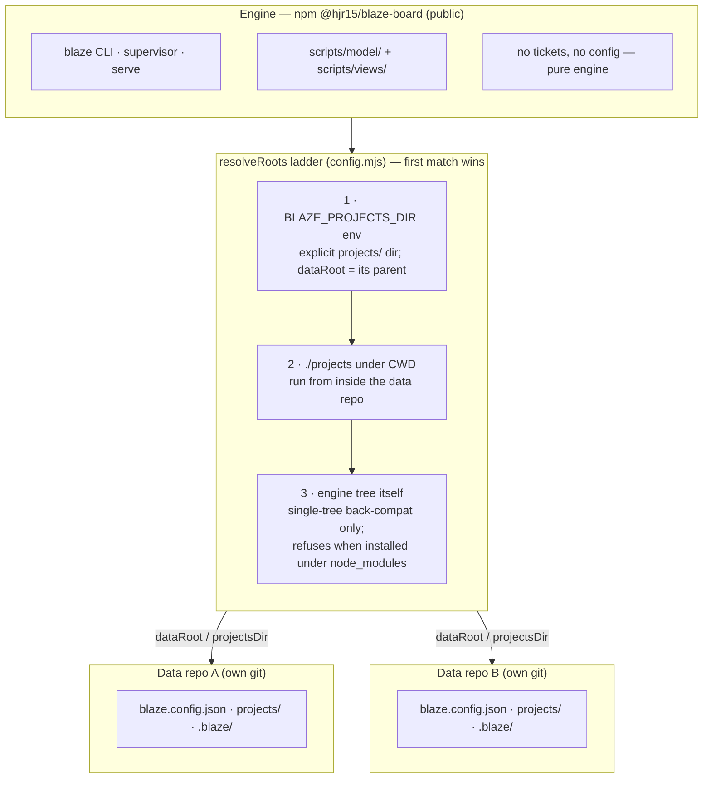

## Caption

Blaze ships as two independent halves. The **engine** is the published package
`@hjr15/blaze-board` — the `blaze` CLI, the web board, and the pure model; it
holds no tickets. The **data repo** is any directory with its own git history
holding `blaze.config.json`, a `projects/<KEY>/<status>/` tree, and the derived
`.blaze/` caches. One global engine install can drive any number of unrelated
data repos. At startup every entry point resolves which data repo to attach to
via the same three-rung `resolveRoots` ladder, so the engine's install location
and the data's location are fully decoupled.

## Worked example

Install the engine once (`npm i -g @hjr15/blaze-board`), then attach it to a data
repo two ways:

- **Run from inside the data repo** — `cd my-tracker && blaze board` matches rung 2
  (`./projects`).
- **Point at it from anywhere** — `BLAZE_PROJECTS_DIR=/path/to/my-tracker/projects
  blaze board` matches rung 1.

Upgrading the engine (`npm update -g`) never touches any board's ticket history;
each data repo keeps its own git log. Rung 3 exists only for the historical
single-tree layout and deliberately throws rather than silently treating an
installed `node_modules/` engine directory as a data root.
