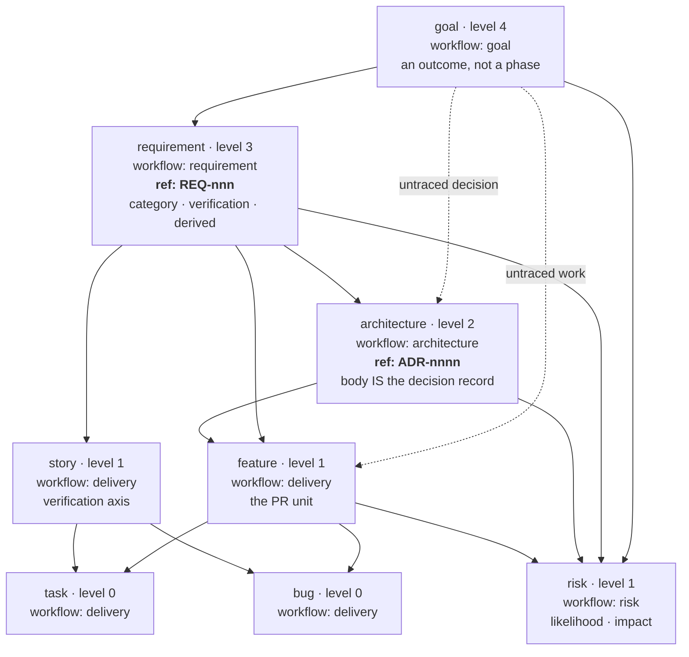

## Caption

The `engineering` preset's type hierarchy — an opt-in registry layered over the
engine defaults through a `schema` block (see
[type-hierarchy.md](type-hierarchy.md) for what ships built in). It separates
*need* (`requirement`), *decision* (`architecture`) and *delivery*
(`feature` → `task`/`bug`) into distinct tickets with distinct lifetimes.

Two types carry a **`ref`** — a project-scoped, human-quotable designator that is
stable for the ticket's whole life. The ticket id (`BLZ-150`) is board identity;
the `ref` (`REQ-001`) is how the item is *cited* from anywhere else. Because a
ticket's status is its directory, its path changes on every transition — the `ref`
is what does not.

## Worked example

A solid arrow points from a **parent** type to a **child** type it may contain.
Dotted arrows are the deliberate escape hatches.

- A `requirement` states a capability and hangs off the `goal` it serves. It is
  cited as `REQ-014`, never by path.
- An `architecture` ticket records one decision; its **body is the decision record**
  (context, decision, consequences, alternatives). It is cited as `ADR-0011`.
- A `feature` is the PR unit — one integration branch, one PR, typically 4–8 child
  tasks. It may hang off the `architecture` that shaped it, the `requirement` it
  delivers, **or** the `goal` directly.
- The two dotted edges exist because some work and some decisions genuinely trace to
  no stated requirement — discovery, operational toil, tech debt, and foundational
  decisions that predate any written need. Forcing them under a manufactured
  requirement makes the traceability matrix a lie. They are **legal, and counted**:
  the matrix publishes the untraced figure rather than hiding it.
- `risk` attaches at any altitude, because a risk to an outcome, a decision and a
  delivery bundle are different risks.

`requirement` and `architecture` carry no `estimate` — time rolls up from the
features and tasks beneath them, and a decision record is not delivery work.
