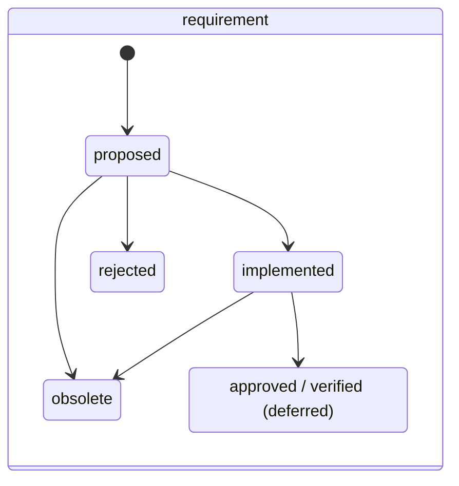
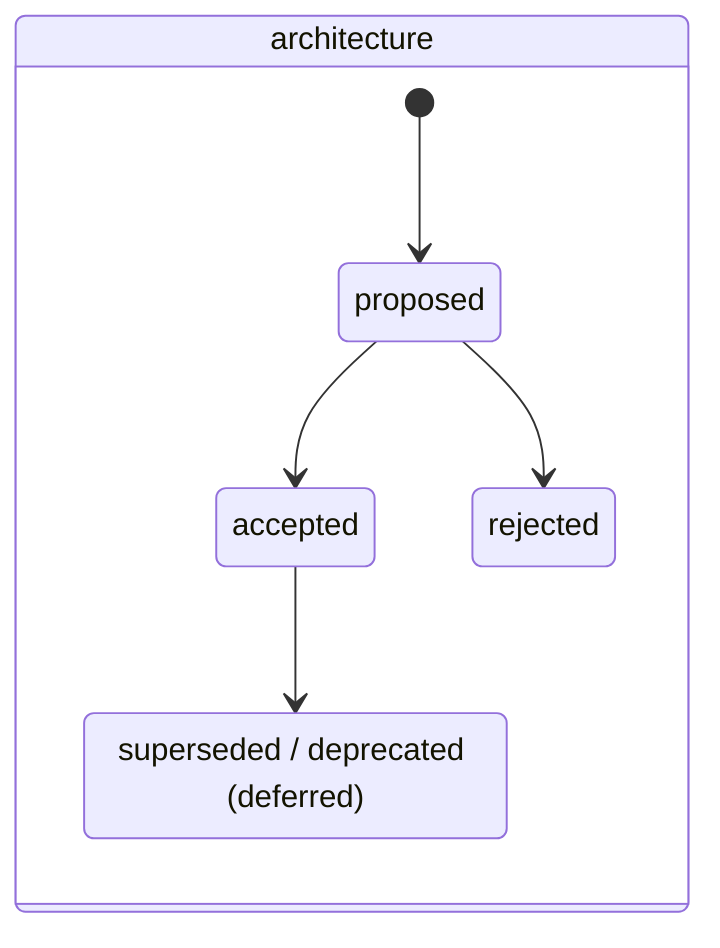

## Caption

The two workflows the `engineering` preset adds, beside the built-in
delivery / goal / risk machines ([workflow-state-machines.md](workflow-state-machines.md)).
Both are type-scoped: a ticket's legal transitions come from the workflow its
**type** maps to, not from a board-wide status list.

Statuses shown dashed are **designed but not shipped**. `approved`, `verified` and
the `accepted → superseded` chain are deferred: each requires someone to return to a
ticket after the work is finished, and on the board this model was developed against,
return-visit obligations complete at 0–15% while fields captured at creation complete
at ~93%. A status nobody flips makes the board less truthful, not more — so they wait
on evidence that the return visit is affordable.

## Worked example

- A `requirement` opens at **`proposed`**. It reaches **`implemented`** when a feature
  linked to it has landed. `rejected` means it was considered and declined;
  `obsolete` means it stopped applying. Both are terminal, both keep their `REQ-nnn` —
  the reference is never reused, so a gap in the sequence is expected and correct.
- An `architecture` ticket opens at **`proposed`** and reaches **`accepted`** when the
  decision is made. Until the supersede chain ships, a replaced decision is recorded
  with a **`Supersedes` link** from the new ticket to the old one, and the old one
  keeps its `accepted` status.
- Reopening is always legal: any status can return to the workflow's `reopenTo`
  (`proposed` for both), which is how a decision or a requirement gets revisited.

Terminal statuses set a `resolution` automatically — `implemented` and `accepted`
resolve to `done`; `rejected` and `obsolete` resolve to `wont-do`. Resolution is a
separate axis from status and is never hand-set.
