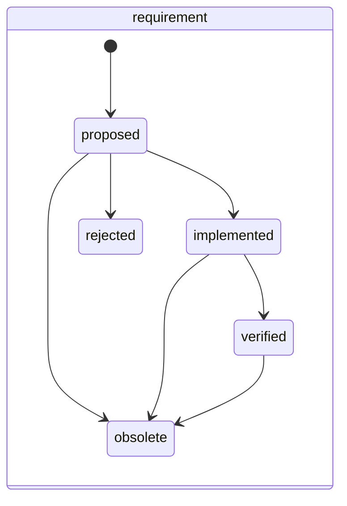
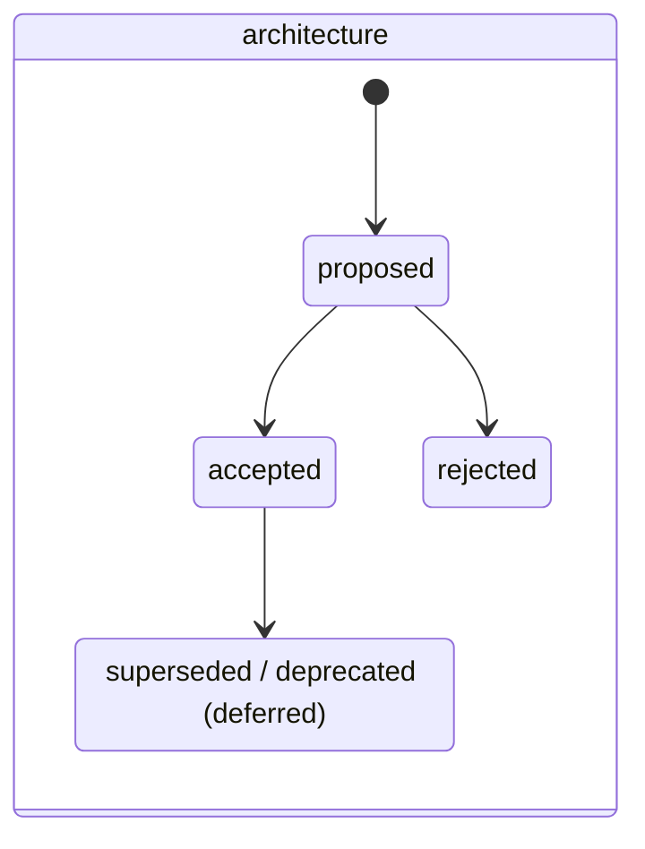

## Caption

The two workflows the `engineering` preset adds, beside the built-in
delivery / goal / risk machines ([workflow-state-machines.md](workflow-state-machines.md)).
Both are type-scoped: a ticket's legal transitions come from the workflow its
**type** maps to, not from a board-wide status list.

Statuses shown dashed are **designed but not shipped**. `approved` and the
`accepted → superseded` chain are still deferred: each requires someone to return to a
ticket after the work is finished, and on the board this model was developed against,
return-visit obligations complete at 0–15% while fields captured at creation complete
at ~93%. A status nobody flips makes the board less truthful, not more — so they wait
on evidence that the return visit is affordable.

**`verified` shipped** (BLZ-339), and ruling R48 (BLZ-353, 2026-08-23) made it load-bearing
rather than optional: a goal cannot close over an unverified requirement. That deliberately
takes on the return-visit cost the paragraph above warns about — the judgement being that a
goal claiming achievement on unverified requirements is a worse falsehood than an unflipped
status. `blaze audit`'s `terminal-goal-unverified-requirement` finding is how the cost stays
visible instead of silently accruing.

## Worked example

- A `requirement` opens at **`proposed`**. It reaches **`implemented`** when a feature
  linked to it has landed, and **`verified`** when something demonstrates it actually holds —
  which is gated on a resolving `Verifies` link, so verification requires evidence, not an
  assertion. `rejected` means it was considered and declined; `obsolete` means it stopped
  applying. All four are terminal, all keep their `REQ-nnn` — the reference is never reused,
  so a gap in the sequence is expected and correct.
- **`implemented` is terminal for the requirement, but it does NOT satisfy a goal.** A goal
  cannot reach `achieved` while any requirement beneath it is merely implemented: delivered is
  not the same as verified, and a goal that claims otherwise asserts something untrue. Only
  `verified`, `rejected` and `obsolete` let a goal close — the latter two because they are
  decisions *not* to deliver. This is ruling R48, settled 2026-08-23 (BLZ-353); the gate lives
  in `scripts/model/gates.mjs` and `blaze audit` reports any board already in that state.
- An `architecture` ticket opens at **`proposed`** and reaches **`accepted`** when the
  decision is made. Until the supersede chain ships, a replaced decision is recorded
  with a **`Supersedes` link** from the new ticket to the old one, and the old one
  keeps its `accepted` status.
- Reopening is always legal: any status can return to the workflow's `reopenTo`
  (`proposed` for both), which is how a decision or a requirement gets revisited.

Terminal statuses set a `resolution` automatically — `implemented` and `accepted`
resolve to `done`; `rejected` and `obsolete` resolve to `wont-do`. Resolution is a
separate axis from status and is never hand-set.
