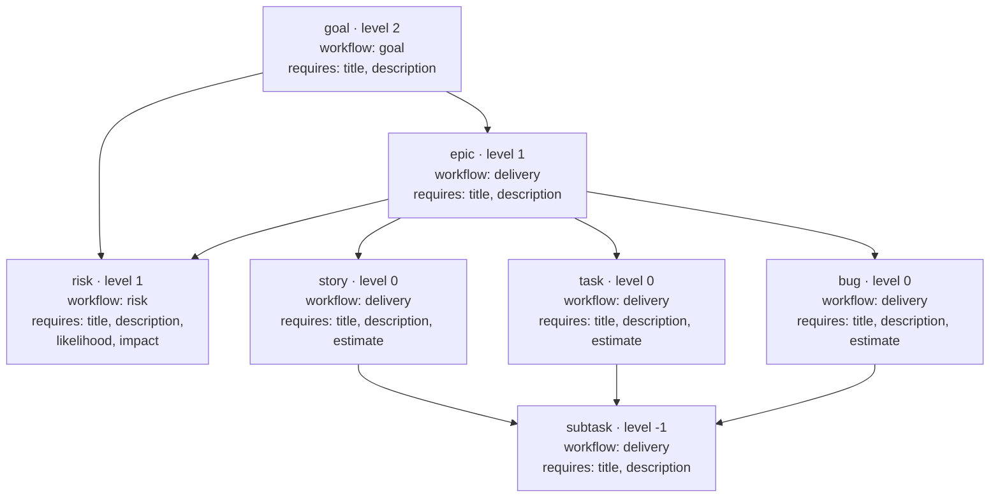

## Caption

The built-in ticket type registry (`scripts/model/schema.mjs`, `DEFAULT_TYPES`).
Every type declares a hierarchy `level`, the parent types it may hang off, the
fields it requires, and which of the three workflows governs it. Parent edges are
validated on every write — including cycle detection — so the work-breakdown
structure is data, not convention. A data repo can override or extend this
registry through a `schema` block in its config without editing engine source; the
diagram shows the defaults.

## Worked example

An arrow points from a **parent** type to a **child** type it may contain:

- A `goal` is top-level (no parent type) and sits above everything.
- An `epic` must hang off a `goal`; `story`/`task`/`bug` must hang off an `epic`;
  a `subtask` hangs off a `story`, `task`, or `bug`.
- A `risk` is the one type with two legal parents — a `goal` **or** an `epic` — and
  is the only leaf-level type carrying `likelihood` and `impact` instead of an
  `estimate`.

Only the delivery-workflow leaf types (`story`/`task`/`bug`/`subtask`) require an
`estimate`; a project can additionally require a worklog before those enter a
terminal status via `requireWorklogBeforeTerminal`. Time rolls up from leaves to
`epic` and `goal` parents, so parents carry no estimate of their own.
