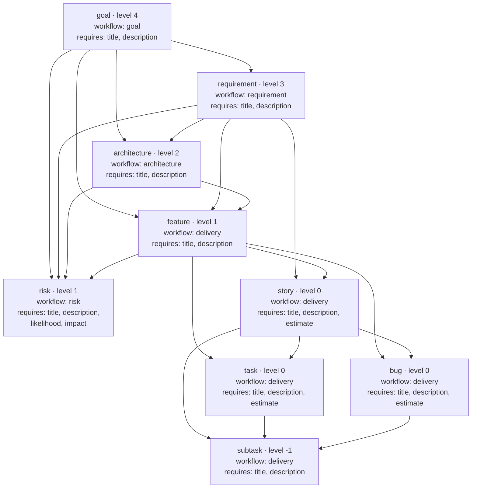

## Caption

The built-in ticket type registry (`scripts/model/schema.mjs`, `DEFAULT_TYPES`).
Every type declares a hierarchy `level`, the parent types it may hang off, the
fields it requires, and which of the three workflows governs it. Parent edges are
validated on every write — including cycle detection — so the work-breakdown
structure is data, not convention. A data repo can override or extend this
registry through a `schema` block in its config without editing engine source; the
diagram shows the defaults.

```mermaid
flowchart TD
    goal["goal · level 4<br/>workflow: goal<br/>requires: title, description"]
    requirement["requirement · level 3<br/>workflow: requirement<br/>requires: title, description"]
    architecture["architecture · level 2<br/>workflow: architecture<br/>requires: title, description"]
    feature["feature · level 1<br/>workflow: delivery<br/>requires: title, description"]
    risk["risk · level 1<br/>workflow: risk<br/>requires: title, description,<br/>likelihood, impact"]
    story["story · level 0<br/>workflow: delivery<br/>requires: title, description, estimate"]
    task["task · level 0<br/>workflow: delivery<br/>requires: title, description, estimate"]
    bug["bug · level 0<br/>workflow: delivery<br/>requires: title, description, estimate"]
    subtask["subtask · level -1<br/>workflow: delivery<br/>requires: title, description"]

    goal --> requirement
    goal --> architecture
    goal --> feature
    goal --> risk
    requirement --> architecture
    requirement --> feature
    requirement --> story
    requirement --> risk
    architecture --> feature
    architecture --> risk
    feature --> story
    feature --> task
    feature --> bug
    feature --> risk
    story --> task
    story --> bug
    story --> subtask
    task --> subtask
    bug --> subtask
```

## Worked example

An arrow points from a **parent** type to a **child** type it may contain:

- A `goal` is top-level (no parent type) and sits above everything.
- `requirement` and `architecture` are the reference spine: a `requirement` hangs
  off a `goal`, an `architecture` off a `requirement` or `goal`.
- A `feature` is the delivery bundle and the PR unit — it hangs off an
  `architecture`, `requirement` or `goal`, and **features do not nest**.
- `story` hangs off a `requirement` or `feature`; `task`/`bug` off a `feature` or
  `story`; a `subtask` off a `story`, `task`, or `bug`.
- A `risk` has the widest choice of parents — `goal`, `requirement`,
  `architecture` or `feature` — and carries `likelihood` and `impact` instead of
  an `estimate`.
- `epic` is **retired** in favour of `feature` (BLZ-231). It is absent from this
  diagram deliberately: it survives in the registry only because the engine
  cannot delete a type, it is unparentable, and no new one should be created.

Only the delivery-workflow leaf types (`story`/`task`/`bug`/`subtask`) require an
`estimate`; a project can additionally require a worklog before those enter a
terminal status via `requireWorklogBeforeTerminal`. Time rolls up from leaves to
`feature`, `requirement` and `goal` parents, so parents carry no estimate of their own.
