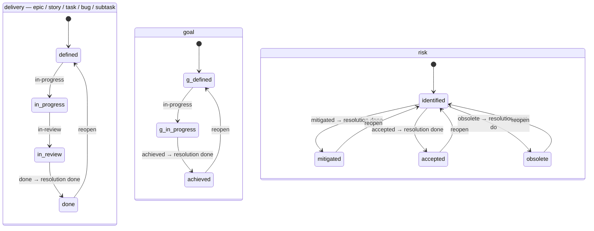

## Caption

The three built-in workflows (`scripts/model/workflows.mjs`, `DEFAULT_WORKFLOWS`).
Each ticket type is bound to exactly one. A move is legal only if it is an adjacent
forward edge or a **reopen** — a jump from any non-initial status back to the
workflow's initial status. Entering a terminal status auto-sets `resolution` (shown
on each terminal edge); leaving a terminal status clears it. Resolution is a
separate axis set by a post-function — it is never coupled into transition
validation, which is why `blaze resolve` can override it (`wont-do`, `duplicate`,
`cannot-reproduce`) without moving the file.

## Worked example

- **delivery** (`defined → in-progress → in-review → done`): the workflow `reconcile`
  drives from a code repo's branch/PR state. A branch matching the ticket key moves
  it to `in-progress`, opening its PR to `in-review`, merging to `done`.
- **goal** (`defined → in-progress → achieved`): always manual — goals carry no
  branch, so `reconcile` never touches them.
- **risk** (`identified → mitigated | accepted | obsolete`): three terminal statuses.
  `mitigated`/`accepted` resolve to `done`; `obsolete` resolves to `wont-do`. Close a
  risk by moving it (`blaze move <id> mitigated`), not with `blaze resolve`.

The reopen edge is drawn from each terminal status back to the initial for clarity,
but the rule is general: a reopen is legal **from any non-initial status** back to
the initial one (`defined` / `identified`), which is what makes reverting an
accidental forward move a single, always-available step.
